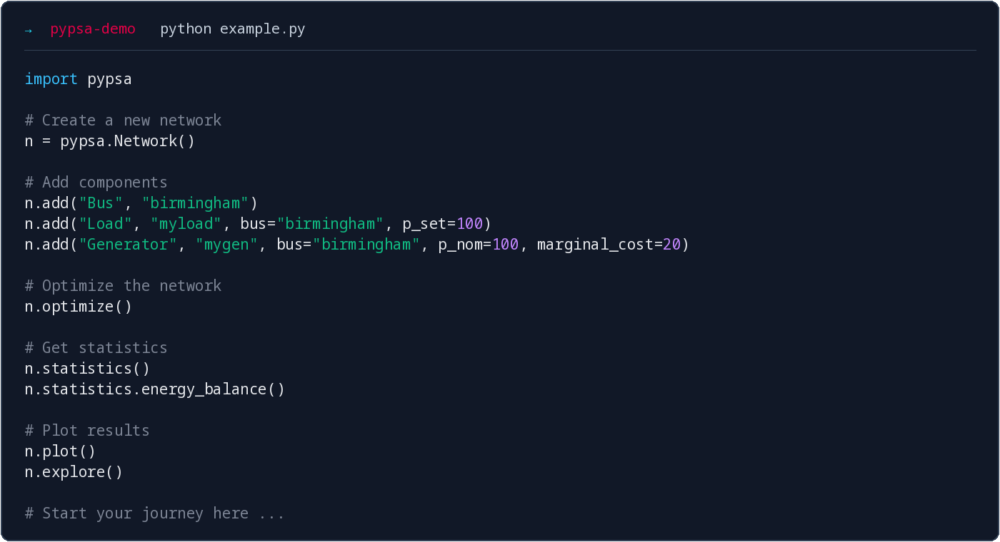

# PyPSA Workshop Berlin

**14–15 October 2026** 
**Berlin · Germany** 
*Organised and hosted by [PyPSA Labs](https://pypsalabs.org/).*

---

## Course outline

This two-day workshop introduces [PyPSA](https://docs.pypsa.org/), an
open-source Python package for energy system modelling and energy infrastructure
planning. It also explores [PyPSA-Eur](https://pypsa-eur.readthedocs.io/), a
European energy system model and data pipeline maintained at TU Berlin.

### What you will learn

- **PyPSA fundamentals:** Data structures and fundamental components,
	formulation of optimisation problems, results retrieval and visualisation
- **Capacity expansion:**  Capacity planning problems with PyPSA
- **Stochastic and risk-averse optimisation:** Handling uncertainty and risk management in energy system models
- **Sector coupling:** Multi-carrier networks and energy conversion
- **Other features:** Custom constraints, the statistics module, network explorer.
- **PyPSA-Eur:** A tour through to the European energy system model workflow and data pipeline

Some familiarity with Python and `pandas` is helpful, but not required. Short introductions to both are included in the annexes.

## Venue

Room: TBD 
Building: TBD, Berlin 
Building entrance · Room · Map: TBD

## Preliminary agenda

:::{div}
:class: workshop-agenda-day

### Day 1 — Wednesday, 14 October 2026

| Time | Session |
|---|---|
| 09:00–10:00 | *Soft start: arrival, coffee, getting to know each other* |
| 10:00–10:45 | **Introduction to the PyPSA ecosystem** |
| 10:45–11:00 | *Break* |
| 11:00–12:30 | **Introduction to optimisation with PyPSA** |
| 12:30–13:30 | *Lunch* |
| 13:30–15:30 | **Modelling with PyPSA: system capacity planning, sector coupling, results retrieval and statistics** |
| 15:30–15:45 | *Break* |
| 15:45–17:00 | **PyPSA-Eur workflow: introduction and hands-on modelling** |
| 17:00–17:30 | **Wrap-up of day 1 and open questions** |
| From 18:30 | *Shared dinner at [Hofbräu Wirtshaus Berlin](https://maps.app.goo.gl/dWfymNViH4gMXoHc6) (near Alexanderplatz)* |

:::

:::{div}
:class: workshop-agenda-day

### Day 2 — Thursday, 15 October 2026

| Time | Session |
|---|---|
| 09:00–10:45 | **PyPSA-Eur: a deeper look at the workflow** |
| 10:45–11:00 | *Break* |
| 11:00–12:30 | **Modelling with PyPSA: stochastic optimisation and risk aversion** |
| 12:30–13:30 | *Lunch* |
| 13:30–15:00 | **Modelling with PyPSA: security of supply analysis** |
| 15:00–15:15 | *Break* |
| 15:15–17:00 | **Open Q&A: PyPSA functionality, workflows, and your own modelling questions** |

:::

## Lecturers

[Dr. Fabian Neumann](https://fneum.org) and [Dr. Iegor Riepin](https://iriepin.com/) are postdoctoral researchers at the
[Department of Digital Transformation in Energy Systems](https://www.tu.berlin/en/ensys)
at [Technische Universität Berlin](https://www.tu.berlin/en). Their research work focuses on identifying cost-effective pathways to climate neutrality, leveraging energy modelling to inform policy and public discourse.

Fabian and Iegor are also co-founders
of [PyPSA Labs](https://pypsalabs.org/).

## Technical setup

### Workshop JupyterHub (recommended)

Run everything in your browser with all packages pre-installed, on the workshop JupyterHub:

1. Open [workshop.pypsalabs.org](https://workshop.pypsalabs.org).
2. Log in with any username you like and the **workshop password** shown by the presenter.
3. The workshop notebooks are already in your workspace. Open `01-pypsa-intro.ipynb` to begin.

Your files are saved between the two workshop days. Use the same username on both days.

### Google Colab (fallback)

No hub access? You can also run the notebooks in [Google Colab](https://colab.research.google.com/): on any notebook page, click **🚀 Open this notebook in Google Colab** (a Google account is required). On Colab you install the packages yourself, as noted at the top of each notebook.

### Local installation

If you prefer to run the notebooks on your own computer, follow the instructions on the next page. You will need to install `pixi`, which sets up Python and all required packages for you.
